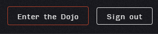

# Home-page

1. В хэдере содержится логотип приложения.
2. Если пользователь авторизован
    - Отображается дропдаун с двумя ссылками:
      - kata library (перенаправляет на [страницу с библиотекой кат](library.md));
      - leaderboards (перенаправляет на [страницу со списком лидеров](leaderboard.md));  
        
    - Отображаются кнопки 
      - Enter the Dojo (перенаправляет на [страницу с библиотекой кат](library.md));
      - Sign out (выход из аккаунта);  
        
3. Если пользователь не авторизован, отображаются кнопки:
    - Log in (авторизация);
    - Join (регистрация);  
      
4. Кнопка get started в секции-приветствии:
    - авторизованного пользователя перенаправляет на [страницу с библиотекой кат](library.md);
    - неавторизованного пользователя перенаправляет на [страницу с формой авторизации](authorization.md);