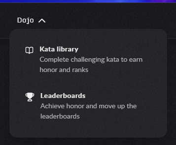
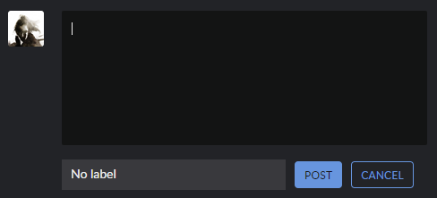
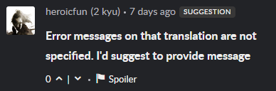

# Kata discuss

1. Блок с фильтрами (фильтрация по меткам issue, suggestion, question, либо вывод без фильтрации)
2. Форма для комментария  
    - Изначально отображается только инпут и Ваша аватарка.  

      

    - При получении фокуса поле разворачивается на всю ширину блока, так же отображается дропдаун для выбора метки (по этим меткам потом призводится фильтрациия. Можно выбрать "no label")  
    - Отображаются кнопки POST (для отправки комментария) и CANCEL (при нажатии на нее поле сворачивается в первоначальное состояние)  

      

3. Список комментариев
    - каждый комментарий содержит информацию об авторе (аватарка, имя, ранк), количество времени, прошедшего с даты публикации (например, "4 months ago"), текст комментария. При клике на имя/аватарку пользователя можно перейти в его профиль
    - для каждого комментария есть возможность поднять-опустить его рейтинг и пометить как спойлер  
    
    

