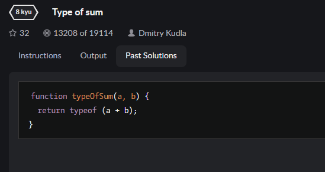
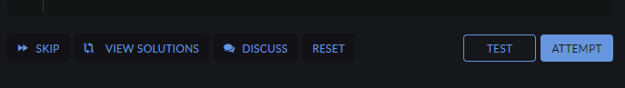
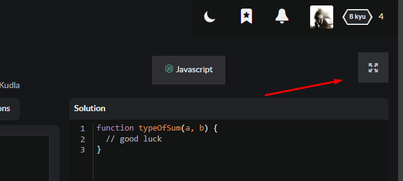

# Kata train

1. Блок с инструкциями к задаче
2. Блок с результатами тестов
3. Если Вы уже решали эту кату, будет доступна вкладка с предыдущими решениями  

      

4. Блок с редактором для ввода кода решения задачи (изначально содержит шаблон задачи; реализована подсветка текста, автоматическое закрытие скобок и помещение курсора внутри них)
5. Блок с кнопками:  

      

    - skip - пропустить кату и перейти к следующей
    - unlock solutions - разблокировать решения (если ранее Вы не решали эту кату). При клике на эту кнопку откроется модальное окно, где нужно будет подтвердить согласие на разблокировку решения.
    - view solutions - показать список решений
    - discuss - перейти на страницу с комментариями по данной кате
    - reset - сбрасывает редактор до первоначального состояния
    - test - запускает некоторое количество базовых тестов
    - attempt - запускает все тесты. При успешном их прохождении кнопка меняется на submit, при клике на которую можно отправить решение

6. Есть возможность развернуть рабочее пространство на весь экран при клике на кнопку  

    