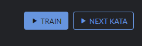
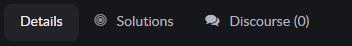

# Kata

1. Общий блок для всех вкладок
    - Блок с информацией о кате (ранк, название, автор, количество добавлений в избранное, количество решений)
    - Кнопки перехода: [страница для решения каты](kata-train.md), следующая ката  
    
      

2. Вкладки:  

      

    - Details (активная по умолчанию, содержит описание каты и инструкция к ней)
    - [Solutions](kata-solutions.md) (вкладка с решениями)
    - [Discourse](kata-discuss.md) (комментарии к текущей кате)  
    
    При переключении между вкладками на активной вкладке рядом с названием отображается количество найденных решений/комментариев (количество решений будет отображаться только в том случае, если ранее Вы уже решали эту кату)

3. Блок с 4 рандомными катами, подобранными по таким же тегам, что и у текущей каты
4. Блок со статистикой текущей каты (отрисован на основании данных с бэкенда)