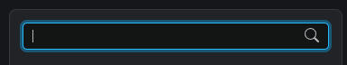
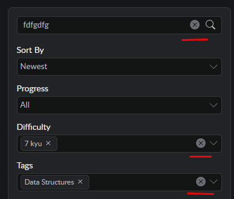
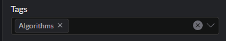
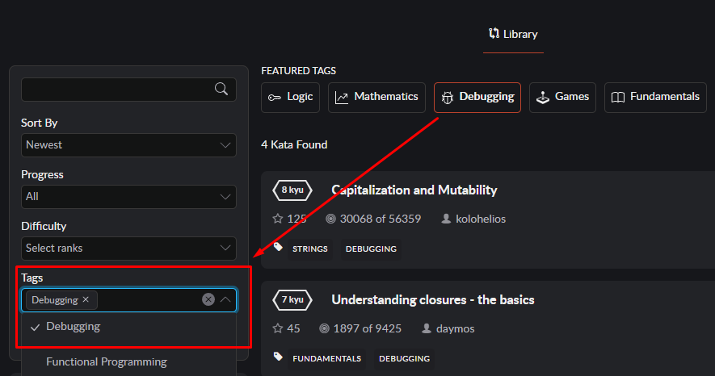
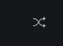
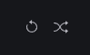

# Kata library

## Сортировка и фильтры
***

Слева от списка задач блок с сортировкой, поиском и фильтрами.
Фильтрация-сортировка реализована на стороне бэкенда

1. Общие свойства для блоков сортировки-фильтра  
    - при фокусе инпут подсвечивается голубым
    
    - при выборе каких-либо тегов в блоках Tags, Difficulty и вводе символов в поле поискового инпута отображается кнопка для очистки блока. При нажатии на эту кнопку соответствующий блок очищается от выбранных ранее фильтров (для поля поиска - очищается инпут от введенных символов).Список кат при этом возвращается в состояние до применения соответствующего фильтра
    
    - при нажатии кнопки открытия дропдауна иконка стрелки поворачивается на 180 градусов, открывается выпадающий список
    - при выборе какого-либо пункта в блоках Sort By, Status, Progress список закрывается
    - в блоках Difficulty и Tags реализована возможность добавления нескольких пунктов сразу, поэтому закрываются списки при клике по кнопке дропдауна либо клике вне блока
    - фильтры применяются при клике на кнопку apply
    - при клике на кнопку reset фильтры очищаются, список кат возвращается в исходное состояние
2. Поиск по названию задачи
    - в блоке присутствует кнопка с иконкой лупы. При ховере на этой кнопке иконка меняет цвет на голубой
    - фильтр применяется либо по нажатию кнопки enter на клавиатуре, либо по нажатию кнопки с лупой в самом блоке поиска
3. Сортировка по: 
    - времени публикации задачи - Newest / Oldest (поле publishedAt из API)
    - по популярности - Popularity
    - по сложности - Hardest / Easiest (поле rank)
    - по алфавиту - Name
    - при выборе какого-либо варианта он отображается в кнопке открытия дропдауна и также отмечается галочкой в выпадающем списке
4. Сортировка по прогрессу 
    - All
    - not trained
    - not completed
    - completed
5. Сложность задачи (поле rank)
6. Фильтрация по тегам
    - при выборе тега он добавляется в кнопку открытия дропдауна в виде блока с кнопкой “удалить” в виде крестика  
    
    - также при выборе тега он отмечается в выпадающем списке галочкой
    - также над списком задач есть блок Featured tags. По нажатию на эти кнопки просто происходит добавление тэга в блок фильтрации по тэгам (добавляется в кнопку открытия дроп-дауна и отмечается галочками в самом списке)  
      

***
## Список задач
***

1. Присутствует блок, в котором выводится количество найденных кат
2. Есть кнопка shuffle, при клике на нее выдается 30 рандомных кат, рядом с кнопкой появляется кнопка для возврата списка в первоначальное состояние  
  

3. Реализована бесконечная подгрузка списка кат.
4. В списке задач отражается следующая информация о кате:
    - ранк
    - название (при клике на название происходит перенаправление на страницу с описанием каты)
    - количество добавления в избранное
    - количество решений
    - автор (при клике на имя автора можно перейти на его профиль)
    - теги
    - язык, на котором можно решить кату (в реализации клона только JS)
5. Решенные пользователем каты выделются в списке.

